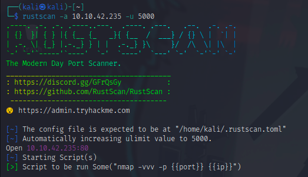
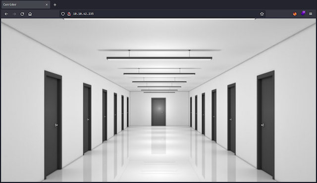
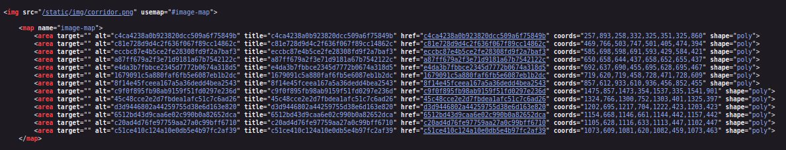
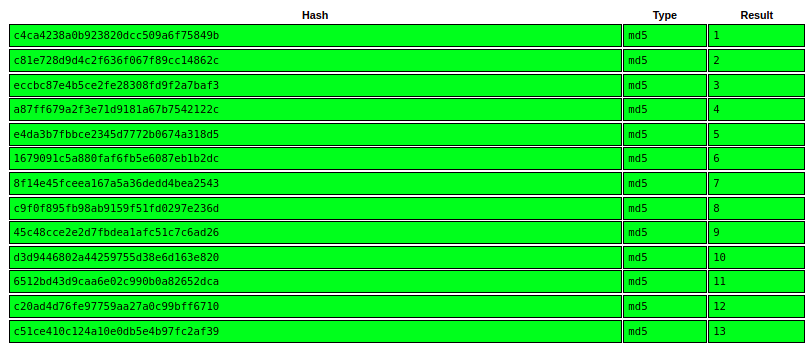
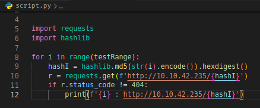

<h1>TryHackMe - Corridor</h1> 

<h2>Reconnaissance</h2>
<ol>
    <li>
        Starting with rustscan.  
         
        Theres only one port open. Let's check it out.
    </li> 
    <li>
        Explorig the WebPage. 
            &emsp; 
            &emsp;its a simple webpage with a lot of doors.  
            &emsp; 
            &emsp;And that it's endpoints are hased values of something. Let's crack them using crackstation  
            &emsp; 
            &emsp;the endpoints are MD5 hash values of numbers from 1 to 13. 
    </li>
    <li>
        Getting the flag. 
            &emsp;The room description suggests us to uncover website locations and also to look at the pattern for help so 
            &emsp;my next step is to write a python script that generates hash of numbers and test's weather they exist here. 
            &emsp; 
            &emsp;And just as i expected, i got an endpoint where i got the flag.  
    </li>
</ol>