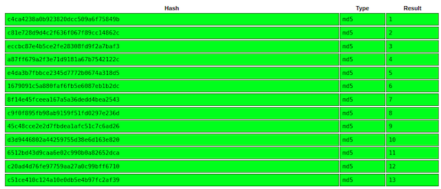

# TryHackMe - Corridor  

  

## Reconnaissance  

1. Starting with rustscan.  

&nbsp; &nbsp; &nbsp; &nbsp;   
&nbsp; &nbsp; &nbsp; &nbsp; Only one port is open. Let's check it out.  

2. Explorig the WebPage

&nbsp; &nbsp; &nbsp; &nbsp;   
&nbsp; &nbsp; &nbsp; &nbsp; It's a webpage with a lot of door's. Let's checkout the source code.  

&nbsp; &nbsp; &nbsp; &nbsp;   
&nbsp; &nbsp; &nbsp; &nbsp; From the room's descriptoin, we know that these are hashes so lets check which one and crack them.  

&nbsp; &nbsp; &nbsp; &nbsp;   
&nbsp; &nbsp; &nbsp; &nbsp; Hash-Identifier specified that these are MD5 hashes and crackstation result shows that these endpoints are MD5 values of numbers from 1 to 13.

## Exploiting  

#### We know the endpoints are hashes of numbers so my next step was to write a python script to find hidden endpoints.